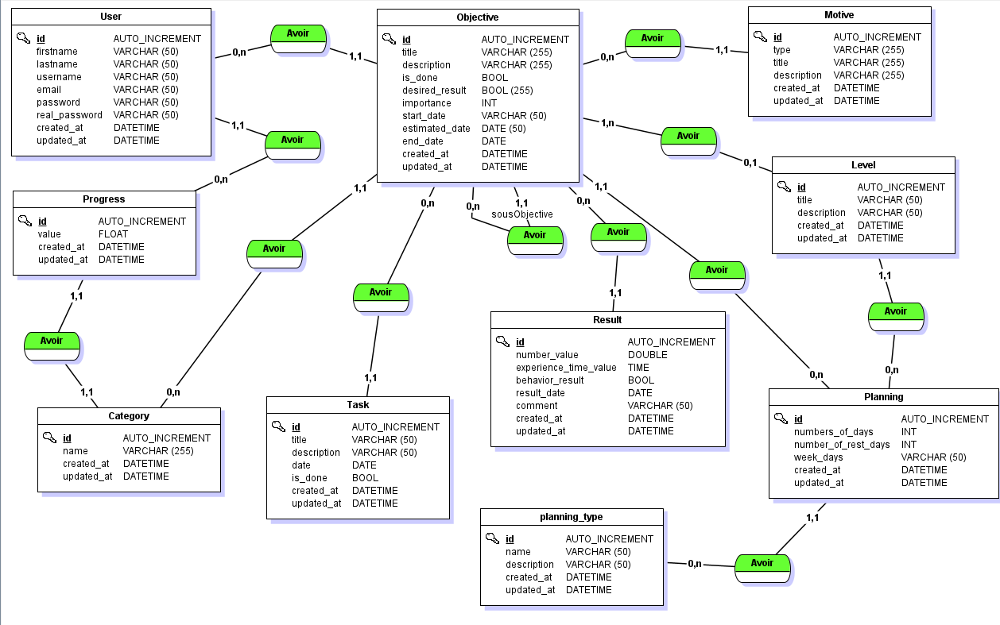
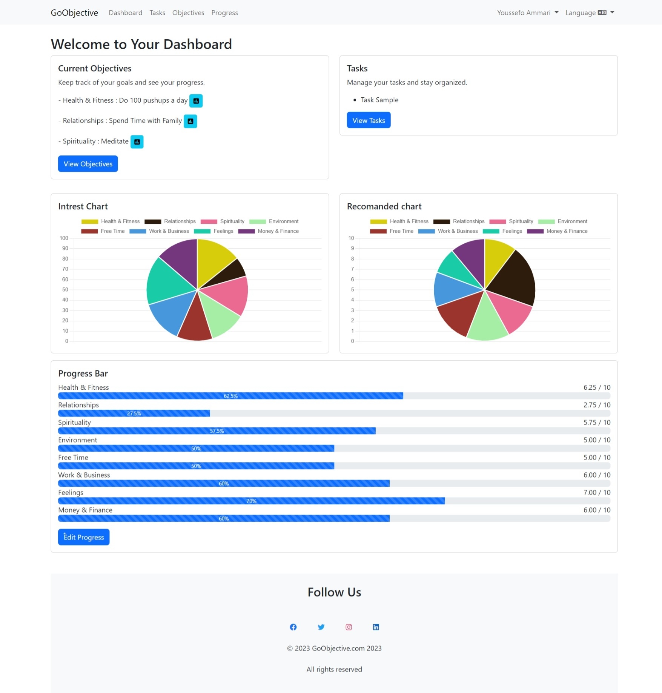
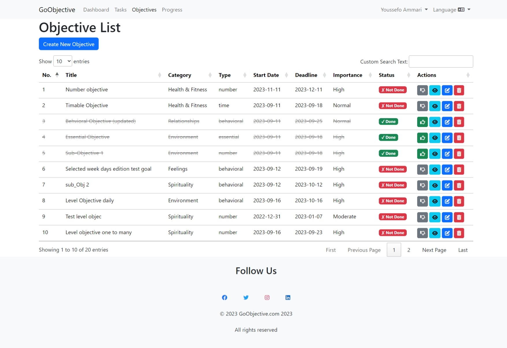
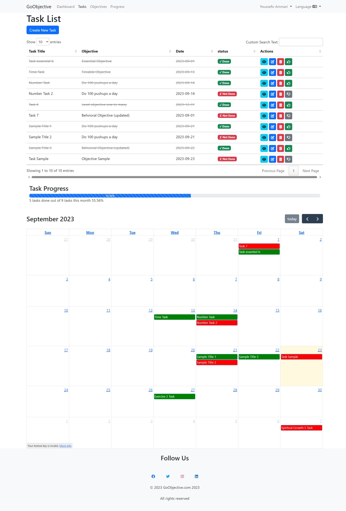
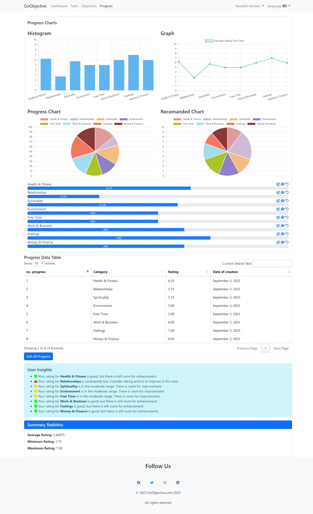

<p align="center"><a href="https://laravel.com" target="_blank"></a><br/> <h1 align="center">GoObjectives</h1></p>

<p align="center">
<a href="https://github.com/laravel/framework/actions"></a>
<a href="https://packagist.org/packages/laravel/framework"></a>
<a href="https://packagist.org/packages/laravel/framework"></a>
<a href="https://packagist.org/packages/laravel/framework"></a>
</p>

# GoObjectives

GoObjectives is a web application built with Laravel, Ajax, and Bootstrap, and it represents the culmination of my internship. This project is designed to help users boost their productivity by setting and tracking their goals effectively.

## About Laravel

Laravel is a web application framework with expressive, elegant syntax. We believe development must be an enjoyable and creative experience to be truly fulfilling. Laravel takes the pain out of development by easing common tasks used in many web projects, such as:

-   [Simple, fast routing engine](https://laravel.com/docs/routing).
-   [Powerful dependency injection container](https://laravel.com/docs/container).
-   Multiple back-ends for [session](https://laravel.com/docs/session) and [cache](https://laravel.com/docs/cache) storage.
-   Expressive, intuitive [database ORM](https://laravel.com/docs/eloquent).
-   Database agnostic [schema migrations](https://laravel.com/docs/migrations).
-   [Robust background job processing](https://laravel.com/docs/queues).
-   [Real-time event broadcasting](https://laravel.com/docs/broadcasting).

Laravel is accessible, powerful, and provides tools required for large, robust applications.

## Features

-   **User Authentication**: Secure user registration and login functionality.
-   **Goal Management**: Create, update, and delete goals.
-   **Task Tracking**: Track tasks related to each goal.
-   **Productivity Dashboard**: Visualize your progress with interactive charts.
-   **Ajax Integration**: Seamlessly update content without page reloads.
-   **Responsive Design**: Ensure a consistent user experience on all devices.

## Technologies & Tools

### Client-side

-   **Blade**: A templating engine for Laravel.
-   **Bootstrap**: A popular CSS framework for building responsive and visually appealing web interfaces.
-   **Chart.js**: A JavaScript library for creating interactive and visually appealing charts.
- **FullCalendar.js**: A JavaScript library for creating interactive and customizable calendars in your web application.


### Server-side

-   **PHP**: The server-side scripting language used in Laravel.
-   **Ajax**: Asynchronous JavaScript and XML, used for seamless data exchange with the server.
-   **jQuery**: A JavaScript library that simplifies HTML document traversal and manipulation.

### Database

-   **MySQL**: A powerful and widely-used relational database management system.

### Merise MCD : 


## Installation

Follow these steps to set up GoObjective locally on your machine:

### Prerequisites

Before you begin, ensure you have met the following requirements:

-   [Composer](https://getcomposer.org/): PHP package manager.
-   [Node.js](https://nodejs.org/): JavaScript runtime.
-   [npm](https://www.npmjs.com/): Node package manager.
-   [MySQL](https://www.mysql.com/): A relational database management system.

### Clone the Repository

1. Clone the GoObjective repository to your local machine:

    ```bash
    git clone
    ```

    ```bash
    cd goobjectives
    ```

2. Install Dependencies

-   Install PHP dependencies using Composer:

    ```bash
    composer install
    ```

-   Install JavaScript dependencies using npm:

    ```bash
    npm install
    ```

3.  Configuration

-   Create a copy of the .env.example file and save it as .env:
-   Generate an application key using command :

    ```
    php artisan key:generate
    ```
- Configure your .env file with your database connection details and any other necessary settings.
4. Database Migration

    ```
    php artisan migrate
    ```
5. Start the Development Server

- Start the Laravel development server:

    ```
    php artisan serve
    ```


- Access the application in your web browser at http://localhost:8000.    

6. Enjoy ^^

## Screenshots

Here are some screenshots of GoObjectives to give you a glimpse of the application:

**Dashboard:**


*This is the dashboard of the GoObjective application. It provides an overview of your goals and tasks, allowing you to see your progress at a glance.*

**Goal Management:**


*In the goal management section, you can create, update, and delete your objectives. This is where you set your goals and define what you want to achieve.*

**Task Tracking:**


*The task tracking screen allows you to manage and track the tasks associated with your objectives. You can mark tasks as complete and monitor your progress. Additionally, you can view your tasks for the month, providing a comprehensive view of your upcoming tasks and deadlines.*

**Productivity Goal Tracking :**


*The productivity objective tracking section provides detailed insights into your objectives. You can see charts and statistics that visualize your progress and help you stay on track.*


*You can assess and rate your progress in each of the nine categories. This feature allows you to evaluate your achievements in various aspects of your goals, helping you to focus on areas that may require more attention and improvement.*